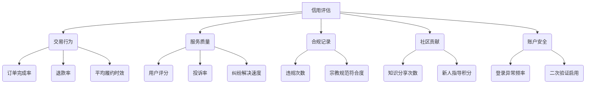
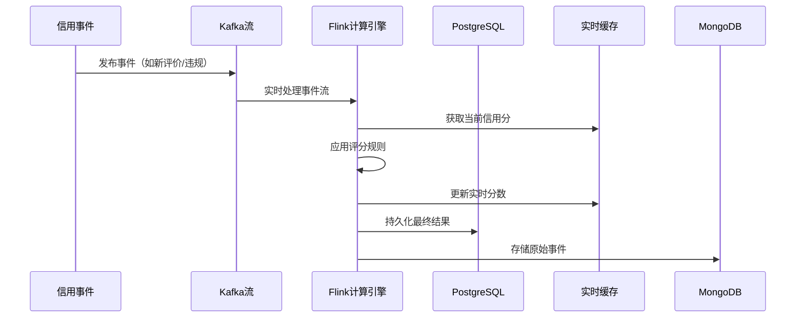
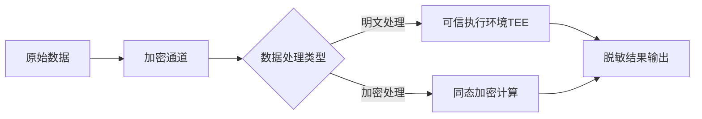
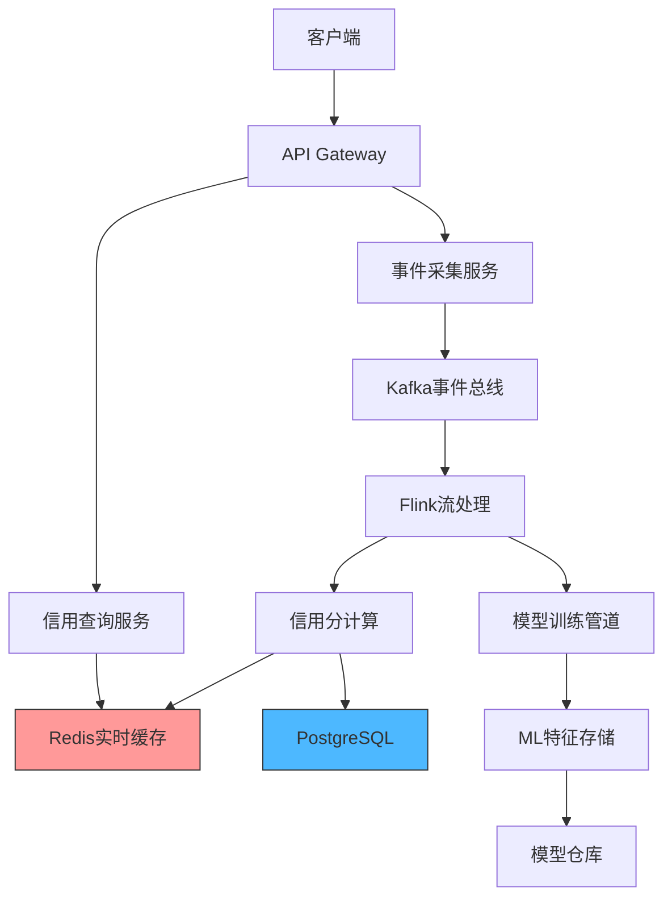

---

### **「商家会员信用评估系统」技术实现方案**

---

#### **一、信用评估指标体系**


---

#### **二、数据存储架构**

##### **PostgreSQL核心表设计**
```sql
-- 商家基础信用分
CREATE TABLE merchant_credit (
    merchant_id UUID PRIMARY KEY,
    base_score NUMERIC(5,2) DEFAULT 100.00,
    last_updated TIMESTAMPTZ DEFAULT NOW(),
    FOREIGN KEY (merchant_id) REFERENCES merchants(id)
);

-- 信用事件日志
CREATE TABLE credit_events (
    event_id BIGSERIAL PRIMARY KEY,
    merchant_id UUID,
    event_type VARCHAR(50), -- 如'positive_review'/'late_delivery'
    impact_value NUMERIC(5,2), -- 分数变动值
    description TEXT,
    created_at TIMESTAMPTZ DEFAULT NOW(),
    INDEX idx_merchant_events (merchant_id, created_at DESC)
);
```

##### **MongoDB文档结构（行为日志）**
```json
{
  "merchant_id": "a1b2c3d4",
  "event_type": "order_completed",
  "details": {
    "order_id": "o123",
    "completion_time_sec": 3600,
    "user_rating": 4.8,
    "religious_compliance_check": {
      "status": "passed",
      "certificate_id": "halal-2024-xyz"
    }
  },
  "timestamp": ISODate("2024-03-20T08:00:00Z")
}
```

---

#### **三、动态信用评分引擎**

##### **1. 实时评分计算流程**


##### **2. 评分规则配置（YAML示例）**
```yaml
rules:
  - name: positive_review
    type: additive
    base_value: 0.5
    conditions:
      - field: user_rating
        operator: ">="
        value: 4.5
        multiplier: 1.2
      - field: review_keywords
        contains: ["清真认证", "专业"]
        bonus: 1.0
        
  - name: delivery_delay
    type: subtractive
    base_value: 2.0
    conditions:
      - field: delay_minutes
        ranges:
          - min: 0
            max: 30
            penalty: 1.0
          - min: 31
            max: 60
            penalty: 3.0
```

##### **3. 机器学习模型集成（Python示例）**
```python
from sklearn.ensemble import IsolationForest

class CreditAnomalyDetector:
    def __init__(self):
        self.model = IsolationForest(n_estimators=100)
        
    def train(self, features):
        """ 输入特征矩阵包括：
            - 订单量波动率
            - 评价情感分析分数
            - 登录地理位置变化频率
        """
        self.model.fit(features)
    
    def predict_risk(self, merchant_data):
        score = self.model.decision_function(merchant_data)
        return 1 - (score + 0.5)  # 转换为0-1风险概率
```

---

#### **四、信用可视化与API**

##### **1. Streamlit信用仪表盘**
```python
def show_credit_dashboard(merchant_id):
    # 获取实时信用分
    base_score = get_credit_score(merchant_id)
    risk_level = get_risk_prediction(merchant_id)
    
    # 可视化布局
    col1, col2, col3 = st.columns(3)
    with col1:
        st.metric("当前信用分", f"{base_score:.1f}", delta="+2.3本周")
        st.altair_chart(render_spider_chart(merchant_id))
    
    with col2:
        st.subheader("风险预警")
        st.progress(risk_level, text=f"异常概率 {risk_level*100:.1f}%")
        st.table(show_top_risk_factors(merchant_id))
    
    with col3:
        st.subheader("关键指标")
        st.write(f"✅ 订单完成率: {get_completion_rate(merchant_id)}%")
        st.write(f"⚠️ 平均响应时间: {get_avg_response(merchant_id)}分钟")
        st.write(f"📜 宗教合规率: {get_compliance_rate(merchant_id)}%")
```

##### **2. 信用API端点（FastAPI）**
```python
@app.get("/credit/{merchant_id}")
async def get_credit_profile(merchant_id: str):
    # 从多数据源聚合信息
    base = get_pg_credit(merchant_id)
    logs = get_recent_events(merchant_id)
    ml_risk = ml_predictor.predict(merchant_id)
    
    return {
        "base_score": base.score,
        "ranking": f"前{base.percentile}%",
        "risk_indicators": [
            {"name": "异常交易模式", "score": ml_risk['transaction']},
            {"name": "服务波动性", "score": ml_risk['service']}
        ],
        "history": transform_event_logs(logs)
    }
```

---

#### **五、信用驱动的运营策略**

##### **1. 动态手续费率计算**
```solidity
// 智能合约实现费率调整
function calculateFeeRate(address merchant) public view returns (uint256) {
    uint256 baseRate = 200; // 2% 基准费率
    CreditInfo memory info = creditScores[merchant];
    
    if(info.score >= 900) return baseRate * 80 / 100; // 八折
    if(info.score >= 800) return baseRate * 90 / 100; 
    if(info.score < 600) return baseRate * 120 / 100; // 上浮20%
    return baseRate;
}
```

##### **2. 信用等级权益体系**
| 信用等级 | 分数区间 | 权益 |
|---------|---------|------|
| 钻石    | 900-1000 | 首页优先展示、0质押开店 |
| 黄金    | 800-899  | 虚拟货币双倍奖励 |
| 白银    | 600-799  | 标准费率 |
| 观察期  | <600     | 交易限额、预付款冻结 |

---

#### **六、数据安全与隐私**

##### **1. 敏感数据处理流程**


##### **2. 隐私保护技术**
- **差分隐私**：在聚合统计时添加随机噪声
- **联邦学习**：商家本地数据不离开设备
- **零知识证明**：验证信用分有效性时不泄露明细

---

#### **七、系统部署架构**



**关键组件版本**：
- Flink 1.17：支持事件时间处理与状态存储
- Redis 7.2：向量搜索支持相似商家比对
- PostgreSQL 15：并行索引加速复杂查询

---

### **总结**
该信用评估系统通过以下创新点实现精准评估：
1. **混合计算架构**：实时流处理+批量机器学习
2. **可解释性设计**：每个信用变动事件均记录可追溯
3. **动态权益体系**：智能合约自动调整商家权益
4. **隐私增强技术**：TEE与同态加密保障敏感数据

实施建议：
1. 初期采用规则引擎快速上线，逐步引入机器学习模型
2. 建立商家信用分申述通道，人工审核特殊案例
3. 定期进行压力测试，确保实时评分延迟<500ms
4. 提供信用提升指导手册，促进商家自我优化