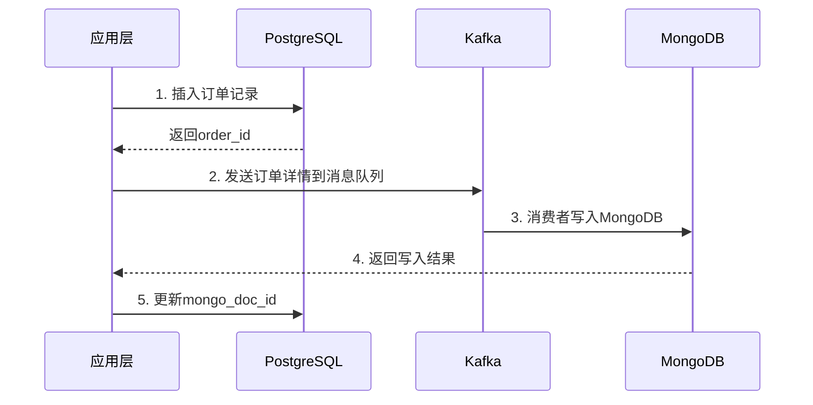
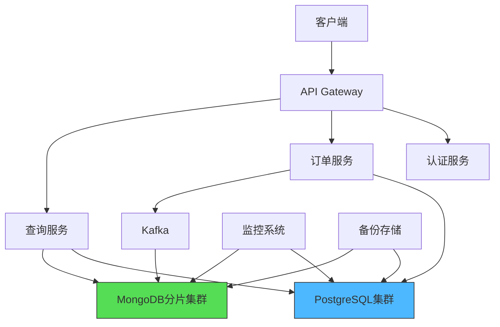

### **混合型数据库设计方案**

#### **一、数据存储划分**
1. **PostgreSQL（关系型数据库）**
   - **核心业务数据**：
     - 用户账户（`users`）
     - 服务类型元数据（`service_types`）
     - 订单记录（`orders`）
     - 支付事务（`payments`）
   - **数据特点**：
     - 结构化程度高
     - 需要ACID事务支持
     - 多表关联查询频繁

2. **MongoDB（文档型数据库）**
   - **动态服务详情**：
     - 清洁服务耗材清单（`cleaning_details`）
     - 运送路线历史（`delivery_logs`）
     - 修缮工程步骤记录（`repair_steps`）
   - **数据特点**：
     - 结构差异大，动态字段多
     - 嵌套文档和数组存储需求
     - 高频读写，地理空间查询

#### **二、数据模型设计示例**
##### **PostgreSQL表结构**
```sql
-- 服务类型元数据表
CREATE TABLE service_types (
    id SERIAL PRIMARY KEY,
    name VARCHAR(50) NOT NULL, -- 如 "清洁服务"
    base_price NUMERIC(10,2),
    mongo_collection VARCHAR(50) -- 关联的MongoDB集合名
);

-- 订单表
CREATE TABLE orders (
    order_id UUID PRIMARY KEY,
    user_id INT REFERENCES users(id),
    service_type_id INT REFERENCES service_types(id),
    mongo_doc_id VARCHAR(24), -- 关联的MongoDB文档ID
    total_price NUMERIC(10,2),
    status VARCHAR(20) CHECK (status IN ('pending','processing','completed'))
);
```

##### **MongoDB文档结构**
```json
// 清洁服务详情文档
{
  "_id": ObjectId("507f1f77bcf86cd799439011"),
  "order_ref": "a1b2c3d4", // 对应PostgreSQL的order_id
  "materials": [
    {"name": "消毒液", "quantity": 2},
    {"name": "抹布", "quantity": 5}
  ],
  "area_m2": 120,
  "special_requirements": "需使用清真认证清洁剂",
  "service_history": [
    {
      "date": ISODate("2024-03-20T08:00:00Z"),
      "worker_id": "W123",
      "duration_min": 180
    }
  ]
}

// 运送服务详情文档
{
  "_id": ObjectId("665f1f77bcf86cd799439022"),
  "order_ref": "e5f6g7h8",
  "vehicle_type": "冷藏货车",
  "route": {
    "start": {"type": "Point", "coordinates": [121.5, 25.0]},
    "end": {"type": "Point", "coordinates": [121.6, 25.1]}
  },
  "temperature_logs": [
    {"time": ISODate("2024-03-20T09:00:00Z"), "temp_c": 4},
    {"time": ISODate("2024-03-20T10:00:00Z"), "temp_c": 5}
  ]
}
```

#### **三、数据关联与同步**
1. **关联方式**：
   - 在PostgreSQL的`orders`表中添加`mongo_doc_id`字段，存储MongoDB文档的`_id`
   - 在MongoDB文档中保留`order_ref`字段，对应PostgreSQL的`order_id`

2. **数据同步策略**：
   - **实时同步**：使用Debezium捕获PostgreSQL的变更日志，通过Kafka同步到MongoDB
   - **异步处理**：订单创建时，应用层同时写入两个数据库，通过事务补偿机制处理失败场景



#### **四、查询优化方案**
1. **跨库查询处理**：
   - **API聚合模式**：
     ```python
     def get_order_details(order_id):
         # 从PostgreSQL获取基础信息
         pg_data = db_pg.execute("""
             SELECT o.*, s.name as service_name 
             FROM orders o
             JOIN service_types s ON o.service_type_id = s.id
             WHERE o.order_id = %s
         """, (order_id,)).fetchone()
         
         # 从MongoDB获取详情
         mg_data = db_mg[pg_data['mongo_collection']].find_one(
             {"order_ref": order_id}
         )
         
         return {**pg_data, "details": mg_data}
     ```
   - **缓存策略**：使用Redis缓存聚合后的完整订单数据，TTL设为5分钟

2. **索引优化**：
   - **PostgreSQL**：
     ```sql
     CREATE INDEX idx_orders_user ON orders(user_id);
     CREATE INDEX idx_orders_status ON orders(status);
     ```
   - **MongoDB**：
     ```javascript
     db.delivery_logs.createIndex({"route.start": "2dsphere"});
     db.cleaning_details.createIndex({"area_m2": 1});
     ```

#### **五、事务管理方案**
1. **Saga模式实现最终一致性**：
   - **正向流程**：
     ```mermaid
     sequenceDiagram
         participant App
         participant PG
         participant MG
        
         App->>PG: Begin Transaction
         PG-->>App: Order Created (状态: pending)
         App->>MG: Insert Service Details
         MG-->>App: Insert Success
         App->>PG: Commit Transaction (状态: confirmed)
     ```
   - **补偿流程**：
     ```mermaid
     sequenceDiagram
         participant App
         participant PG
         participant MG
        
         App->>MG: Delete Service Details
         MG-->>App: Delete Success
         App->>PG: Rollback Transaction
     ```

2. **定时对账任务**：
   ```python
   def reconcile_orders():
       # 查找状态不一致的订单
       pg_orders = db_pg.execute("""
           SELECT order_id FROM orders 
           WHERE status = 'pending' 
             AND created_at < NOW() - INTERVAL '1 hour'
       """)
       
       for order in pg_orders:
           mg_doc = db_mg.service_details.find_one({"order_ref": order.id})
           if not mg_doc:
               db_pg.execute("""
                   UPDATE orders SET status = 'failed'
                   WHERE order_id = %s
               """, (order.id,))
   ```

#### **六、安全与监控**
1. **数据加密**：
   - PostgreSQL：使用pgcrypto扩展加密敏感字段
   - MongoDB：启用TLS加密传输，使用Field-Level Encryption

2. **监控指标**：
   | 指标名称                  | PostgreSQL预警阈值 | MongoDB预警阈值     |
   |--------------------------|--------------------|---------------------|
   | 查询延迟                 | > 500ms           | > 300ms            |
   | 连接数使用率             | > 80%             | > 75%              |
   | 复制延迟                 | > 10秒            | > 5秒（副本集）    |
   | 存储空间使用率           | > 85%             | > 80%              |

3. **备份策略**：
   - **PostgreSQL**：每日全量备份 + WAL日志持续归档
   - **MongoDB**：每小时oplog增量备份，每日快照存储至S3

#### **七、混合架构优势对比**
| **场景**               | **PostgreSQL优势**                          | **MongoDB优势**                          |
|------------------------|---------------------------------------------|------------------------------------------|
| 新服务类型上线         | 需修改表结构，停机时间较长                   | 动态Schema，即时生效                      |
| 订单状态更新           | 事务保证100%一致性                           | 无锁快速写入                              |
| 查询历史服务轨迹       | 需复杂空间扩展                               | 原生GeoJSON查询，毫秒响应                 |
| 生成月度服务报告       | 复杂SQL聚合高效完成                          | 需要额外ETL处理                           |
| 处理突发高并发订单     | 垂直扩展成本高                               | 分片集群自动水平扩展                      |

#### **八、部署架构图示**


**关键组件说明**：
- **PostgreSQL集群**：采用Patroni管理的高可用集群，3节点部署
- **MongoDB分片集群**：包含2个分片，每个分片3节点副本集
- **Kafka消息队列**：3节点集群处理数据同步
- **Redis缓存**：缓存热点查询结果，降低数据库压力

---

### **总结**
该混合架构通过以下方式实现最佳平衡：
1. **数据模型适配**：结构化数据用PostgreSQL，动态服务详情用MongoDB
2. **查询优化**：API层聚合+缓存策略提升用户体验
3. **事务管理**：Saga模式保障跨库操作的最终一致性
4. **扩展能力**：MongoDB水平扩展应对服务数据增长，PostgreSQL垂直扩展处理核心交易

实施时建议：
1. 优先建立数据同步监控机制
2. 对开发团队进行跨数据库查询优化培训
3. 使用统一的数据治理平台管理两种数据库
4. 定期执行跨库数据一致性校验