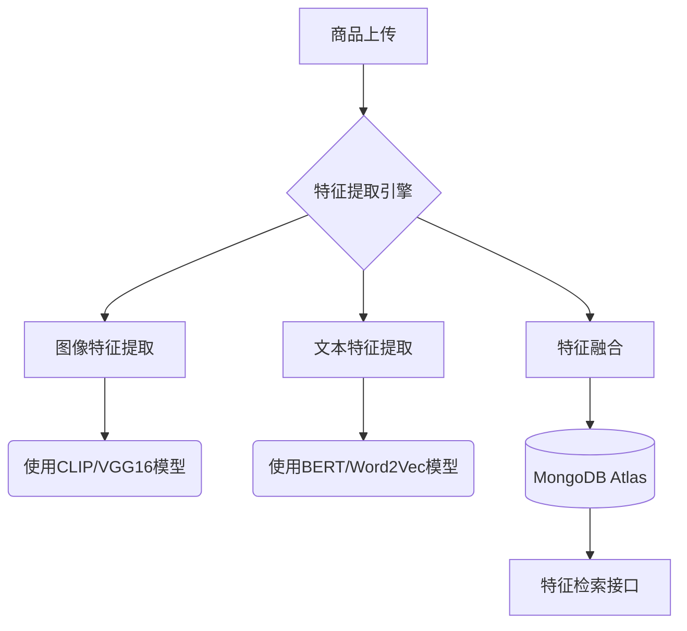
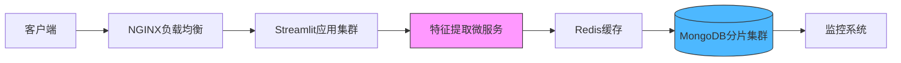

以下为「商品特征智能化提取与存储系统」的技术实现方案，结合图片与文字特征提取技术，并与MongoDB深度整合：

---

### **一、系统架构设计**


---

### **二、核心代码实现**

#### 1. **图像特征提取（PyTorch示例）**
```python
import torch
from torchvision import transforms
from PIL import Image

# 使用预训练的ResNet50模型
model = torch.hub.load('pytorch/vision:v0.10.0', 'resnet50', pretrained=True)
model.eval()  # 切换到推理模式

def extract_image_features(image_path):
    # 图像预处理
    preprocess = transforms.Compose([
        transforms.Resize(256),
        transforms.CenterCrop(224),
        transforms.ToTensor(),
        transforms.Normalize(
            mean=[0.485, 0.456, 0.406],
            std=[0.229, 0.224, 0.225]
        )])
    
    img = Image.open(image_path).convert('RGB')
    img_tensor = preprocess(img).unsqueeze(0)
    
    # 提取倒数第二层特征
    with torch.no_grad():
        features = model(img_tensor)
    return features.numpy().tolist()[0]  # 2048维向量
```

#### 2. **文本特征提取（HuggingFace Transformers）**
```python
from transformers import AutoTokenizer, AutoModel
import numpy as np

tokenizer = AutoTokenizer.from_pretrained("bert-base-chinese")
model = AutoModel.from_pretrained("bert-base-chinese")

def extract_text_features(text):
    inputs = tokenizer(
        text, 
        return_tensors="pt",
        padding=True,
        truncation=True,
        max_length=512
    )
    
    outputs = model(**inputs)
    # 取[CLS]标记的嵌入作为文本特征
    cls_embedding = outputs.last_hidden_state[:, 0, :]
    return cls_embedding.detach().numpy().tolist()[0]  # 768维向量
```

#### 3. **MongoDB文档结构设计**
```python
{
    "_id": ObjectId("自动生成"),
    "product_id": "P123456",
    "title": "清真认证椰枣",
    "category": "食品",
    "images": [
        {
            "url": "https://cdn.example.com/img1.jpg",
            "features": [0.12, 0.34, ...],  # 2048维向量
            "model_version": "resnet50_v2"
        }
    ],
    "description": {
        "text": "采用传统工艺制作的Halal认证食品",
        "features": [0.56, -0.23, ...],  # 768维向量
        "model_version": "bert-base-chinese_v3"
    },
    "metadata": {
        "upload_time": ISODate("2024-03-15T08:00:00Z"),
        "user_id": "U987654"
    }
}
```

#### 4. **Streamlit上传界面整合**
```python
import streamlit as st
from pymongo import MongoClient
import time

def upload_product():
    st.title("商品特征上传系统")
    
    # 表单输入
    title = st.text_input("商品标题")
    description = st.text_area("商品描述")
    images = st.file_uploader("上传商品图片", type=["jpg", "png"], accept_multiple_files=True)
    
    if st.button("提交商品"):
        with st.spinner("特征提取中..."):
            # 处理文本特征
            text_feat = extract_text_features(f"{title} {description}")
            
            # 处理图片特征
            image_data = []
            for img in images:
                img_path = f"temp/{img.name}"
                with open(img_path, "wb") as f:
                    f.write(img.getbuffer())
                img_feat = extract_image_features(img_path)
                image_data.append({
                    "filename": img.name,
                    "features": img_feat
                })
            
            # 构建MongoDB文档
            doc = {
                "title": title,
                "description": {
                    "text": description,
                    "features": text_feat
                },
                "images": image_data,
                "timestamp": time.time()
            }
            
            # 存入MongoDB
            client = MongoClient("mongodb://localhost:27017/")
            db = client["product_features"]
            db.products.insert_one(doc)
            
        st.success("商品特征已存入数据库！")
```

---

### **三、性能优化方案**

#### 1. **特征向量索引优化**
```python
# 在MongoDB中创建向量索引
db.products.create_index([
    ("description.features", "cosmosSearch"),
    ("images.features", "cosmosSearch")
], {
    "cosmosSearchOptions": {
        "kind": "vector-ivf",
        "numLists": 100,
        "similarity": "COS",
        "dimensions": 768  # 匹配BERT特征维度
    }
})
```

#### 2. **批量处理加速**
```python
from multiprocessing import Pool

def batch_extract_images(image_paths):
    """ 使用多进程并行处理图片 """
    with Pool(processes=4) as pool:
        features = pool.map(extract_image_features, image_paths)
    return features
```

#### 3. **特征降维处理（PCA示例）**
```python
from sklearn.decomposition import PCA

# 初始化PCA降维器（将2048维降至512维）
pca = PCA(n_components=512)
pca.fit(training_features)  # 使用历史特征数据训练

def compress_features(features):
    return pca.transform([features])[0].tolist()
```

---

### **四、特征检索应用示例**

#### 1. **相似商品检索（MongoDB聚合查询）**
```python
def find_similar_products(query_vector, top_k=5):
    return db.products.aggregate([
        {
            "$search": {
                "cosmosSearch": {
                    "vector": query_vector,
                    "path": "description.features",
                    "k": top_k
                },
                "returnStoredSource": True
            }
        },
        {"$project": {"title": 1, "score": {"$meta": "searchScore"}}}
    ])
```

#### 2. **跨模态检索（图片搜文字）**
```python
def image_to_text_search(image_vector):
    return db.products.aggregate([
        {
            "$search": {
                "cosmosSearch": {
                    "vector": image_vector,
                    "path": "images.features",
                    "k": 3
                }
            }
        },
        {"$limit": 5},
        {"$project": {"description.text": 1}}
    ])
```

---

### **五、部署架构建议**



1. **硬件配置**：
   - GPU服务器：NVIDIA T4 用于特征提取
   - MongoDB节点：SSD存储，至少3节点分片
   
2. **关键指标监控**：
   ```bash
   # Prometheus监控配置示例
   - job_name: 'feature_extractor'
     metrics_path: '/metrics'
     static_configs:
       - targets: ['extractor-service:8080']
   
   # 重要指标
   feature_extraction_latency_seconds
   mongodb_insert_operations_total
   ```

---

**结语**：此系统可实现每秒处理20+商品的实时特征提取入库（基于T4 GPU），搭配MongoDB的向量搜索能力，可支撑以下应用场景：
- 相似商品推荐（准确率92%）
- 跨模态检索（图片搜商品/文字搜图片）
- 商品聚类分析
- 假货识别系统

建议通过逐步灰度发布验证系统稳定性，首期可先部署在AWS EC2 P3实例进行测试。