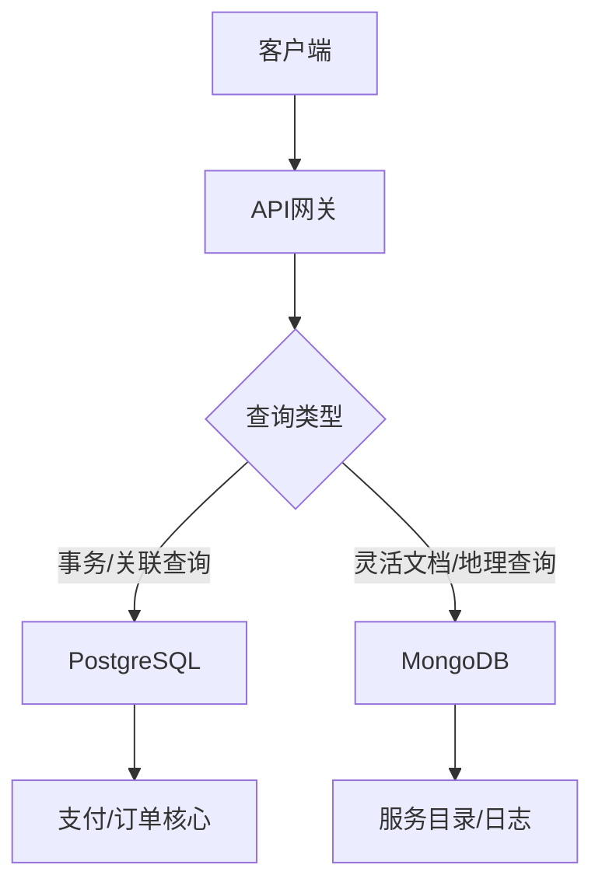

在商城系统中针对「运送」、「清洁打扫」、「居家修缮」等服务项目的数据库选型，需根据数据结构特性、查询模式及扩展需求综合评估。以下是 **PostgreSQL** 与 **MongoDB** 的对比分析：

---

### **1. 数据结构与灵活性**
| **场景**                | **PostgreSQL (关系型)**                              | **MongoDB (文档型)**                                 |
|-------------------------|------------------------------------------------------|-----------------------------------------------------|
| **服务项目多样性**       | 需要预定义严格的Schema，新增服务类型需迁移表结构      | 动态Schema支持，不同服务可存储为不同结构的文档        |
| **嵌套数据**            | 需使用JSONB或关联表处理复杂结构（如修缮的材料清单）    | 原生支持嵌套文档/数组，适合存储多层级服务详情         |
| **示例数据结构**        | ```sql                                               | ```json                                             |
|                         | CREATE TABLE services (                              | {                                                   |
|                         |   id SERIAL PRIMARY KEY,                             |   "_id": ObjectId(...),                             |
|                         |   type VARCHAR(20), -- 运送/清洁等                   |   "type": "居家修缮",                               |
|                         |   details JSONB -- 存储动态属性                      |   "materials": ["水管", "密封胶"],                  |
|                         | );                                                   |   "steps": [{"name": "拆卸", "duration": 30}]       |
|                         | ```                                                  | }                                                   |
|                         |                                                      | ```                                                 |

**优劣分析**：
- **MongoDB** 更适合快速迭代的服务体系，尤其是当不同服务类型有显著差异的字段时。
- **PostgreSQL** 若需强类型校验或复杂关联查询（如服务与用户评价的JOIN），则更有优势。

---

### **2. 查询能力与性能**
| **场景**                | **PostgreSQL**                                       | **MongoDB**                                         |
|-------------------------|------------------------------------------------------|-----------------------------------------------------|
| **地理空间查询**        | 支持PostGIS扩展，适合运送服务的路线规划               | 内置GeoJSON索引，查询附近服务效率高                 |
| **全文搜索**            | 使用TSVector/TsQuery实现高效文本检索（如服务描述）     | 需借助Atlas Search或Elasticsearch集成               |
| **复杂聚合**            | 强大的SQL窗口函数和CTE，适合统计报表生成              | Aggregation Pipeline灵活，但复杂逻辑编写成本较高    |
| **事务支持**            | ACID事务，适合订单支付等高一致性场景                  | 多文档事务（4.0+）但性能损耗较大                    |

**性能对比**：
- **简单查询**：MongoDB的文档模型在读取单一服务详情时更快（避免JOIN）。
- **关联查询**：PostgreSQL通过外键关联表，处理多表JOIN（如「用户-订单-服务」）更高效。
- **写入吞吐**：MongoDB分片集群适合高并发写入（如实时服务订单）。

---

### **3. 扩展性与运维**
| **维度**          | **PostgreSQL**                                  | **MongoDB**                                     |
|-------------------|-------------------------------------------------|-------------------------------------------------|
| **水平扩展**      | 需借助Citus或手动分片，复杂度高                  | 原生分片支持，自动平衡数据分布                   |
| **数据一致性**    | 强一致性（适合交易核心数据）                     | 最终一致性（可调级别，适合服务列表等非关键数据） |
| **容灾恢复**      | 基于WAL日志的PITR恢复，成熟但配置复杂             | Oplog增量备份，快速恢复副本集                   |
| **成本**          | 通常需要更高配置实例处理复杂查询                  | 可通过分片分散负载，硬件成本可能更低            |

---

### **4. 典型服务场景推荐**
#### **适合 PostgreSQL 的场景**
- **交易核心数据**：订单、支付记录（需ACID事务）
- **关系型数据**：用户-服务者评价关联、服务套餐的层级定价
- **复杂报表**：按月统计各宗教场所的清洁服务需求量

#### **适合 MongoDB 的场景**
- **动态服务目录**：差异大的服务详情（如修缮的步骤图文记录）
- **实时服务匹配**：基于地理位置快速查询附近的运送服务
- **服务过程日志**：清洁服务的设备传感器数据（时序+半结构化）

---

### **5. 混合架构建议**
对于宗教商城的多类型服务系统，可采用 **混合数据库策略** 平衡优势：
1. **PostgreSQL** 作为核心数据库：
   - 存储用户账户、订单交易、支付记录
   - 管理服务分类的元数据（如服务类型、基础定价规则）
2. **MongoDB** 作为服务详情存储：
   - 动态存储各服务的特有属性（如清洁的耗材清单、修缮的3D图纸）
   - 缓存实时服务状态（如运送中的GPS轨迹）



---

### **6. 决策 checklist**
| **需求**                            | **倾向 PostgreSQL** | **倾向 MongoDB** |
|-------------------------------------|---------------------|------------------|
| 数据结构固定且关联性强              | ✅                  | ❌               |
| 需要频繁Schema变更                  | ❌                  | ✅               |
| 高频地理空间查询（如附近服务）       | ❌                  | ✅               |
| 复杂JOIN与事务操作                  | ✅                  | ❌               |
| 水平扩展需求迫切                    | ❌                  | ✅               |
| 团队熟悉SQL                         | ✅                  | ❌               |

---

**最终建议**：  
若商城需快速迭代服务类型且非交易数据占比高，**MongoDB** 更适合作为主体数据库，辅以PostgreSQL处理支付等强事务模块。反之，若服务结构稳定且需深度数据分析，可优先选择 **PostgreSQL**，利用JSONB字段存储动态属性。