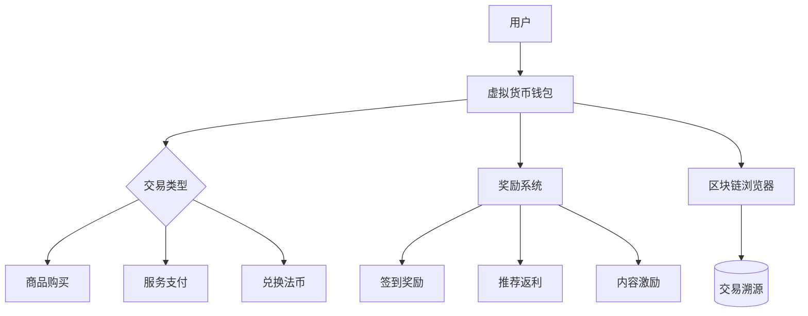
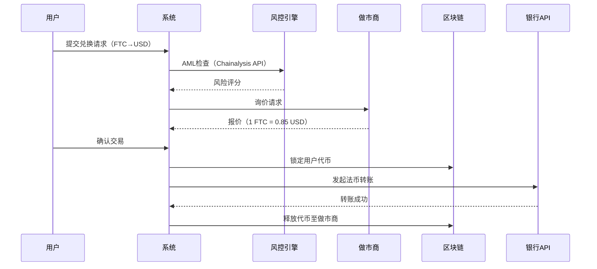
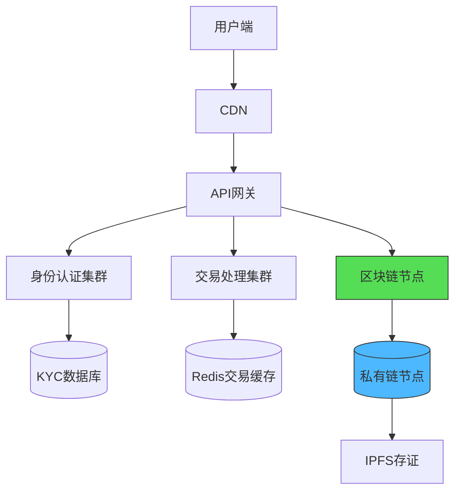

---

### **「商城虚拟货币系统」技术实现方案**

---

#### **一、虚拟货币架构设计**


---

#### **二、核心模块实现**

##### 1. **代币发行（ERC-20 智能合约）**
```solidity
// SPDX-License-Identifier: MIT
pragma solidity ^0.8.0;

contract FaithToken {
    string public name = "Faith Coin";
    string public symbol = "FTC";
    uint8 public decimals = 18;
    uint256 public totalSupply;
    address public platform;

    mapping(address => uint256) private _balances;
    mapping(address => mapping(address => uint256)) private _allowances;

    event Transfer(address indexed from, address indexed to, uint256 value);
    event Approval(address indexed owner, address indexed spender, uint256 value);

    constructor(uint256 initialSupply) {
        totalSupply = initialSupply * 10**decimals;
        _balances[msg.sender] = totalSupply;
        platform = msg.sender;
    }

    function balanceOf(address account) public view returns (uint256) {
        return _balances[account];
    }

    function transfer(address to, uint256 amount) public returns (bool) {
        require(_balances[msg.sender] >= amount, "Insufficient balance");
        _balances[msg.sender] -= amount;
        _balances[to] += amount;
        emit Transfer(msg.sender, to, amount);
        return true;
    }

    // 平台专属铸造权
    function mint(address to, uint256 amount) public {
        require(msg.sender == platform, "Only platform can mint");
        totalSupply += amount;
        _balances[to] += amount;
    }

    // 交易手续费销毁（每笔交易销毁1%）
    function _transferWithFee(address from, address to, uint256 amount) internal {
        uint256 fee = amount / 100;
        _balances[from] -= amount;
        _balances[to] += amount - fee;
        _balances[address(0)] += fee; // 销毁至零地址
        totalSupply -= fee;
    }
}
```

##### 2. **奖励发放系统（Python微服务）**
```python
from web3 import Web3
import redis

class RewardSystem:
    def __init__(self):
        self.w3 = Web3(Web3.HTTPProvider(os.getenv("BLOCKCHAIN_RPC")))
        self.contract = self.w3.eth.contract(address=CONTRACT_ADDRESS, abi=CONTRACT_ABI)
        self.redis = redis.Redis(host='localhost', port=6379, db=0)

    def grant_signin_reward(self, user_address):
        """ 每日签到奖励 """
        key = f"signin:{user_address}:{datetime.today().strftime('%Y%m%d')}"
        if not self.redis.exists(key):
            tx_hash = self.contract.functions.mint(
                user_address, 
                10 * 10**18  # 奖励10 FTC
            ).transact({'from': PLATFORM_WALLET})
            self.redis.setex(key, 86400, "claimed")  # 24小时缓存
            return tx_hash

    def handle_referral(self, referrer, referee):
        """ 推荐关系返利 """
        if self.redis.sadd("referral:relationships", f"{referrer}-{referee}") == 1:
            # 给推荐人发放5%返利
            self.contract.functions.mint(
                referrer,
                REFERRAL_REWARD * 10**18
            ).transact()
```

---

#### **三、虚拟货币经济模型**

| 机制类型 | 具体规则 | 技术实现方式 |
|---------|---------|-------------|
| **发行机制** | 初始发行1亿枚，每年通胀率2% | 智能合约定期铸造 |
| **获取途径** | - 新用户注册送100 FTC<br>- 交易返利3%<br>- 优质评论奖励5 FTC/条 | Redis记录发放状态 + 合约mint方法 |
| **消耗场景** | - 支付时享9折优惠<br>- 兑换专属宗教商品<br>- 购买平台广告位 | 前端价格计算模块 + 合约代扣逻辑 |
| **通缩机制** | - 每笔交易销毁1%<br>- 季度代币回购计划 | 交易时自动销毁 + 链下回购资金池 |

---

#### **四、法币兑换通道整合**

##### 1. **OTC交易系统架构**


##### 2. **兑换接口代码**
```python
import requests

def get_fiat_rate(currency='USD'):
    """ 通过做市商API获取实时汇率 """
    response = requests.get(
        f"https://api.marketmaker.com/rate?base=FTC&target={currency}",
        headers={"Authorization": f"Bearer {API_KEY}"}
    )
    return response.json()['rate']

def execute_otc_trade(user_id, ftc_amount, direction='sell'):
    # 1. 检查用户余额
    balance = contract.functions.balanceOf(user_wallets[user_id]).call()
    if balance < ftc_amount:
        raise InsufficientBalanceError
    
    # 2. 锁定代币
    contract.functions.transfer(ESCROW_WALLET, ftc_amount).transact()
    
    # 3. 法币支付
    rate = get_fiat_rate()
    fiat_amount = ftc_amount * rate
    bank_response = bank_api.transfer(
        account=user_bank_accounts[user_id],
        amount=fiat_amount
    )
    
    # 4. 结算确认
    if bank_response.success:
        contract.functions.transfer(MARKET_MAKER_WALLET, ftc_amount).transact()
    else:
        contract.functions.transfer(user_wallets[user_id], ftc_amount).transact()
```

---

#### **五、合规与安全措施**

1. **KYC/AML集成**
   ```python
   def verify_kyc(user_data):
       # 使用Sumsub API进行身份验证
       response = requests.post(
           "https://api.sumsub.com/identity/verify",
           json={
               "user": user_data['id'],
               "documents": user_data['documents']
           },
           headers={"X-App-Token": SUMSUB_TOKEN}
       )
       return response.json()['reviewResult'] == 'GREEN'
   
   def check_aml(address):
       # 使用Chainalysis检测风险地址
       risk_score = requests.get(
           f"https://api.chainalysis.com/risk/{address}",
           headers={"Token": CHAINALYSIS_KEY}
       ).json()['risk']
       return risk_score < 30
   ```

2. **冷热钱包管理策略**
   ```
   热钱包（在线）：
   - 存储 <5% 总流通量
   - 支持多签（3/5 签名规则）
   - 每2小时自动归集至冷钱包
   
   冷钱包（离线）：
   - 使用HSM硬件模块存储私钥
   - 物理存放在银行保险库
   - 每月审计余额
   ```

---

#### **六、用户界面整合（Streamlit）**

```python
import streamlit as st

def show_wallet_page(user):
    st.title("我的信仰钱包")
    
    col1, col2 = st.columns(2)
    with col1:
        # 显示余额
        ftc_balance = contract.functions.balanceOf(user.wallet).call() / 1e18
        st.metric(label="当前余额", value=f"{ftc_balance:.2f} FTC")
        
        # 充值入口
        with st.expander("充值获取FTC"):
            st.selectbox("充值方式", ["信用卡", "加密货币"])
            amount = st.number_input("充值金额", min_value=10.0)
            if st.button("确认充值"):
                handle_fiat_topup(user, amount)
    
    with col2:
        # 交易记录
        st.subheader("最近交易")
        txs = get_transactions(user.wallet)
        st.table(pd.DataFrame(txs, columns=["时间", "类型", "金额"]))
        
        # 兑换法币
        if st.button("兑换成USD"):
            launch_otc_flow(user)
```

---

### **七、系统部署架构**



**性能指标**：
- 代币交易确认时间：<3秒（私有链优化）
- 每日交易吞吐量：50万笔
- 钱包API响应时间：<500ms

---

**运营策略建议**：
1. 初期空投计划：向宗教机构捐赠账户发放5%代币
2. 交易手续费优惠：使用FTC支付仅收0.5%手续费（法币支付收2%）
3. 质押挖矿：锁定FTC可获得商品折扣券与平台治理权
4. 季度销毁公示：每季度公开销毁代币数量与钱包地址

此系统通过经济激励深度绑定用户与平台，结合区块链技术确保资产透明性，需特别注意各国虚拟货币法规差异，建议在不同地区部署符合当地合规要求的定制版本。